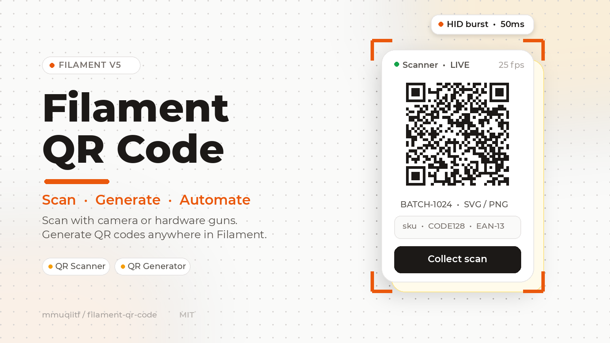

# Filament QR Code



[](https://packagist.org/packages/mmuqiitf/filament-qr-code)
[](https://github.com/mmuqiitf/filament-qr-code/actions?query=workflow%3Arun-tests+branch%3Amain)
[](https://phpstan.org/)
[](https://packagist.org/packages/mmuqiitf/filament-qr-code)

A powerful, modern QR code package designed exclusively for **Filament v5** and **Laravel 11 / 12 / 13**.

Features:

- 📷 **Interactive Camera Scanner**: Real-time camera stream, rear-camera prioritization with remembered choice, responsive decode box synced to the on-screen reticle, and image upload fallback with zero CDN latency.
- 🔗 **Sequential Scanning**: One shared camera feed walks through a multi-field checklist (`QrScanSequence`), with editable or locked steps.
- 🔫 **Hardware Scanner Support**: Native burst keystroke detection (<50ms) that absorbs trailing `Enter` keys to prevent premature form submissions.
- 📦 **Batch Collector (Repeaters & Lists)**: Continuous scanning mode with duplicate protection and sound/haptic confirmation for rapid inventory logging.
- 🎨 **Full QR Generator Suite**: Generate SVG & PNG QR codes with captions/text overlays, logo embedding, and schema components for Forms, Tables, Infolists, and Actions.
- 🔊 **Sensory Confirmation**: Instant zero-latency synthesized Web Audio tone and mobile haptic feedback, pitch and duration tunable per component.

---

- [Filament QR Code](#filament-qr-code)
  - [Requirements](#requirements)
  - [How it works](#how-it-works)
  - [Installation](#installation)
    - [Symbologies](#symbologies)
  - [Quick start](#quick-start)
  - [Usage](#usage)
    - [Which component do I need?](#which-component-do-i-need)
    - [Basic implementation](#basic-implementation)
    - [Advanced implementation](#advanced-implementation)
    - [Full guides](#full-guides)
  - [Troubleshooting](#troubleshooting)
  - [Reporting issues](#reporting-issues)
  - [Contributing](#contributing)
  - [Changelog](#changelog)
  - [Security Vulnerabilities](#security-vulnerabilities)
  - [Credits](#credits)
  - [License](#license)

---

## Requirements

- PHP `^8.2`, Laravel 11/12/13, Filament v5.
- PNG generation needs `gd` or `imagick` plus system fonts (`fonts-dejavu-core` on Debian).
- Camera scanning needs a secure context (`https` or `localhost`).
- The camera bundle (`html5-qrcode`) is compiled into `resources/dist/` — no CDN. After changing anything under `resources/js` or `resources/css`, rebuild with `npm run build` (CI fails when committed `dist/` is stale).

---

## How it works

- **Camera scanning** runs fully in the browser: a modal viewfinder streams the camera through the bundled decoder. The decoder chunk lazy-loads on first camera use; pages that only render QR images never fetch it.
- **Hardware scanners** emulate keyboards: they burst keystrokes in a few dozen milliseconds and end with a terminator key (`Enter`/`Tab`). The interceptor buffers bursts, swallows the terminator so forms don't submit, and routes the value to the active field.
- **Sequences and collectors** write through `$wire.set` into your Livewire form state, so scanned values behave like typed input (validation and reactivity included). Camera DOM lives under `wire:ignore` so Livewire morphs never kill a running feed.
- **Generation** is server-side: renders are cached in-process plus in the Laravel cache, so repeated values encode once. Table modal previews load lazily through a signed image route instead of embedding a data-URI per row.

---

## Installation

You can install the package via composer:

```bash
composer require mmuqiitf/filament-qr-code
```

Publish the configuration file (optional):

```bash
php artisan vendor:publish --tag="filament-qr-code-config"
```

Register the plugin in your Filament Panel Provider (optional — JS/CSS
auto-register globally via the service provider, so existing installs that
already call `->plugin()` keep working with no duplicate tags):

```php
use Mmuqiitf\FilamentQrCode\FilamentQrCodePlugin;

public function panel(Panel $panel): Panel
{
    return $panel
        // ...
        ->plugin(FilamentQrCodePlugin::make());
}
```

The camera decoder (`html5-qrcode`, ~375K) is split into a lazy chunk:
the global bundle is ~20K and the decoder downloads once, on first camera
use. Pages that only render QR images never fetch it.

### Symbologies

Pass `BarcodeFormat` cases (or raw strings) via `->formats([...])` on every camera component. Supported: `QrCode`, `Aztec`, `DataMatrix`, `Maxicode`, `Codabar`, `Code39`, `Code93`, `Code128`, `Itf`, `Ean13`, `Ean8`, `UpcA`, `UpcE`. Filtering formats speeds up decoding and cuts false positives — always set it when you know what you scan. One-dimensional codes automatically get a wide decode band instead of a square.

---

## Quick start

```php
use Mmuqiitf\FilamentQrCode\Forms\Components\QrScanner;

QrScanner::make('sku')->label('SKU'),
```

Camera modal, upload fallback, and hardware-scanner capture all work out of the box. Add `->formats([...])` when you know the symbology — the guides below are upgrades to this.

---

## Usage

### Which component do I need?

| Job                                                 | Use                                                                                                                                                                                                                      | Why not the others                                                                 |
| --------------------------------------------------- | ------------------------------------------------------------------------------------------------------------------------------------------------------------------------------------------------------------------------ | ---------------------------------------------------------------------------------- |
| One input scanned by camera, upload, typing, or gun | [`QrScanner`](docs/scanning.md#1-individual-qr-scanner-field)                                                                                                                                                            | Sequence/collector add moving parts a single field doesn't need.                   |
| Cashier/POS gun, no camera UI                       | [`QrHardwareScannerListener`](docs/scanning.md#2-hands-free-station-mode-qrhardwarescannerlistener) + [one funnel method](docs/scanning.md#step-2--funnel-every-scan-into-one-method)                                    | `QrScanner`'s field listener would double-handle the same burst.                   |
| One camera walking many fields in order             | [`QrScanSequence`](docs/scanning.md#3-sequential-scanning--one-scanner-many-fields)                                                                                                                                      | Chained `nextField()` hops between separate cameras; the sequence shares one feed. |
| Two fields, hand focus from one to the next         | [`QrScanner::nextField()`](docs/scanning.md#4-focus-handoff-between-fields)                                                                                                                                              | A sequence is overkill without a shared checklist.                                 |
| Many scans into one list (stocktake, receiving)     | [`QrCollector` / `QrCollectAction`](docs/collecting.md#5-batch-collector-scanning-repeaters--tables)                                                                                                                     | Sequences map one scan to one field; collectors append.                            |
| Show a QR (form, table, infolist, download)         | [`QrCodeDisplay`](docs/generating.md#in-form-schemas) / [`QrColumn`](docs/generating.md#in-table-columns) / [`QrEntry`](docs/generating.md#in-infolists) / [`DownloadQrAction`](docs/generating.md#as-a-download-action) | Scanner components capture; these only render.                                     |
| Many QRs out at once (labels, handover)             | [`DownloadQrBulkAction`](docs/generating.md#as-a-bulk-zip-export) + print sheet                                                                                                                                          | Single downloads don't scale past a handful of rows.                               |

### Basic implementation

Single field with camera, upload fallback, and hardware-scanner capture:

```php
use Mmuqiitf\FilamentQrCode\Forms\Components\QrScanner;
use Mmuqiitf\FilamentQrCode\Enums\BarcodeFormat;

QrScanner::make('sku')
    ->formats([BarcodeFormat::QrCode, BarcodeFormat::Code128])
    ->sound(true);
```

Hands-free station — one gun driving the whole page, no camera UI:

```php
use Mmuqiitf\FilamentQrCode\Forms\Components\QrHardwareScannerListener;

QrHardwareScannerListener::make(['sku', 'quantity'])
    ->autoFocusNext(true);
```

One camera walking many fields in order:

```php
use Mmuqiitf\FilamentQrCode\Forms\Components\QrScanSequence;

QrScanSequence::make(['batch_number', 'serial_number'])
    ->statePath('sequence')
    ->formats([BarcodeFormat::QrCode]);
```

Continuous batch scanning into a list:

```php
use Mmuqiitf\FilamentQrCode\Forms\Components\QrCollector;

QrCollector::make('scanned_items')
    ->allowDuplicates(false);
```

Render a QR from record data:

```php
use Mmuqiitf\FilamentQrCode\Forms\Components\QrCodeDisplay;
use Mmuqiitf\FilamentQrCode\Tables\Columns\QrColumn;

QrCodeDisplay::make('qr')
    ->data(fn ($record) => $record?->uuid)
    ->size(200);

QrColumn::make('sku')
    ->thumbnailSize(48)
    ->previewable();
```

Cashier/POS flow with a handheld gun: see the [POS tutorial](docs/scanning.md#tutorial-cashier-pos-with-a-handheld-scanner).

### Advanced implementation

Tune defaults globally (`php artisan vendor:publish --tag="filament-qr-code-config"` → `config/qr-code.php`), or per component — component options always win:

```php
QrScanner::make('sku')
    ->fps(25)
    ->qrbox(250)
    ->hardwareScanner(terminators: ['Enter', 'Tab'], minBarcodeLength: 2)
    ->beepFrequency(880)
    ->beepDuration(80);
```

Normalize and reject live scans (`scanFormat()` / `onScan()` never run on live scans — they are programmatic-only):

```php
QrScanner::make('sku')
    ->normalizeUsing(fn ($rawValue) => strtoupper(trim((string) $rawValue)))
    ->rejectWhen(fn ($state) => strlen((string) $state) < 3, 'Barcode too short.');
```

Audit server-observed scans (live scans stay client-side until they reach the server):

```php
use Illuminate\Support\Facades\Event;
use Mmuqiitf\FilamentQrCode\Events\QrCodeScanned;

// config/qr-code.php
'audit' => ['enabled' => true, 'channel' => null],

// or listen yourself:
Event::listen(QrCodeScanned::class, fn ($event) => logger()->info("Scanned {$event->code}"));
```

Build payloads without hand-escaping:

```php
use Mmuqiitf\FilamentQrCode\Support\QrPayload;

QrPayload::wifi('Shop Floor', 'secret-1');
```

UI strings live under `filament-qr-code::ui` (publish with `--tag="filament-qr-code-translations"`); wrap QR images in `.filament-qr-label-sheet` / `.filament-qr-label` for printable shelf labels. Full tables, events, and extension hooks: [Reference](docs/reference.md).

### Full guides

- [Scanning](docs/scanning.md) — camera field, station listener, sequences, focus handoff, POS tutorial.
- [Batch collecting](docs/collecting.md) — continuous inventory scanning in repeaters and tables.
- [Generating](docs/generating.md) — display components, download actions, facade, payloads.
- [Reference](docs/reference.md) — configuration, events, customizing, extending.

---

## Troubleshooting

Run the built-in checks first:

```bash
php artisan qr-code:doctor
```

| Symptom                                      | Likely cause                                                              | Fix                                                                                                                                               |
| -------------------------------------------- | ------------------------------------------------------------------------- | ------------------------------------------------------------------------------------------------------------------------------------------------- |
| Camera modal says no devices / access denied | Page served over plain `http` (not `localhost`)                           | Serve via `https` or test on `localhost`; browsers block cameras in insecure contexts.                                                            |
| Camera modal empty on first open             | Permission not granted yet, labels unavailable                            | Grant permission, reopen; the remembered `localStorage` choice wins afterwards.                                                                   |
| Stale scanner UI after updating the package  | Committed `dist/` rebuilt but host serving old assets                     | `npm run build` in the package, then `php artisan filament:assets` in the host app.                                                               |
| PNG looks wrong / text overlay is blocky     | Missing GD/Imagick or system fonts                                        | Install `gd` or `imagick` plus `fonts-dejavu-core`; the service falls back to GD bitmap fonts otherwise.                                          |
| Sequence submit misses scanned values        | `statePathPrefix()` doesn't match the schema `statePath()`                | Set both to the same prefix, or give the sequence `->statePath()` and read via `mergeSequenceState()`. A banner warns in the UI when they differ. |
| Same burst handled twice                     | Field `QrScanner` listener + page `QrHardwareScannerListener` both active | Keep the global listener; field handlers stand down automatically (or `->suppressWhenGlobalListener(false)`).                                     |
| Typed text becomes a "scan"                  | `minBarcodeLength` too low for a keyboard-heavy form                      | Raise `minBarcodeLength` to 4–6 on that component.                                                                                                |
| Table page is slow with many QRs             | Eager modal data-URIs per row                                             | Keep `->lazyModal()` (default) and the persistent cache enabled; tune `generator.cache_ttl`.                                                      |

## Reporting issues

1. Run `php artisan qr-code:doctor` and include its output.
2. Include your PHP / Laravel / Filament versions (`php -v`, `composer show laravel/framework filament/filament`), plus for camera issues the browser and whether the page is served over `https`/`localhost`, and for gun issues the scanner model and its suffix keys.
3. Describe expected vs actual, with a minimal schema snippet that reproduces it.

Security vulnerabilities are handled privately — see [Security Vulnerabilities](#security-vulnerabilities), not public issues.

## Contributing

PRs welcome! See [CONTRIBUTING.md](CONTRIBUTING.md) for the test suite, static analysis, code style, and frontend build workflow.

---

## Changelog

Please see [CHANGELOG.md](CHANGELOG.md) for more information on what has changed recently.

## Security Vulnerabilities

Please review [our security policy](../../security/policy) on how to report security vulnerabilities.

## Credits

- [Mohamad Muqiit Faturrahman](https://github.com/mmuqiitf)
- [All Contributors](../../contributors)

## License

The MIT License (MIT). Please see [License File](LICENSE.md) for more information.
